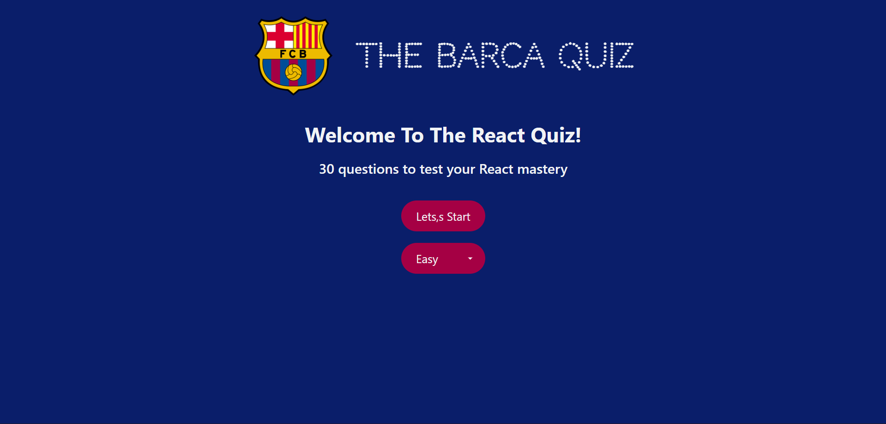
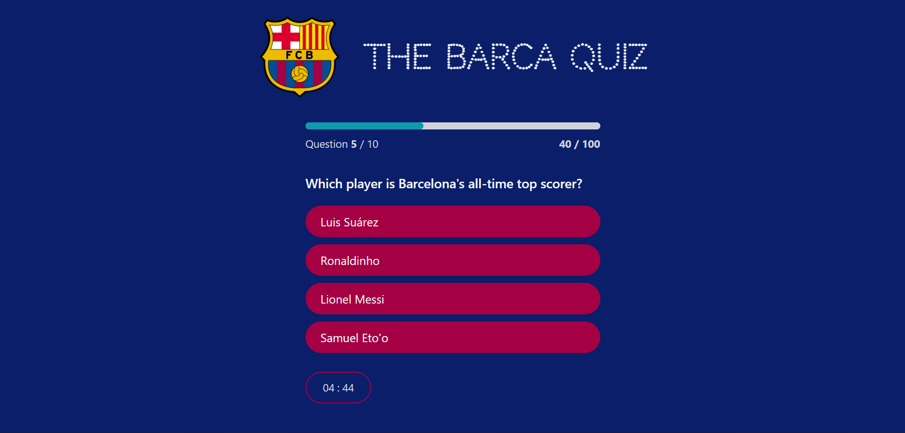
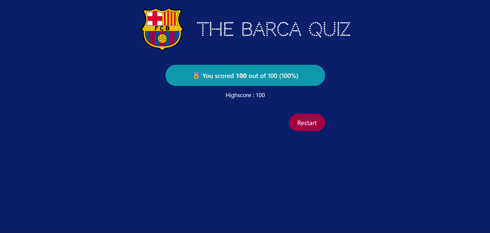

# 🎉 The Barca Quiz

Welcome to **The Barca Quiz** – a fun and interactive React quiz app to test your knowledge about **FC Barcelona**! ⚽🔥

---

## 📝 Overview

This project is a **React-based quiz application** featuring:

- Multiple choice questions with dynamic difficulty levels.
- Real-time timer for each quiz session.
- Score tracking and highscore recording.
- Progress bar and answer feedback with animations.

---

## 🚀 Features

- **Start Screen**: Select difficulty (Easy, Medium, Hard) before starting.
- **Progress Tracker**: Shows current question, points, and total points.
- **Timer**: Countdown for quiz completion.
- **Finish Screen**: Displays score, percentage, emoji rating, and highscore.
- **Restart Quiz**: Quickly reset and replay the quiz.

---

## 🛠 Tech Stack

- **React.js** – Frontend library
- **React Hooks** – `useReducer`, `useContext` for state management
- **Fetch API** – Load questions from a backend or local JSON

---

## 🖼 Preview





---

## ⚡ Getting Started

### 1. Clone the repository

```bash
git clone https://github.com/yourusername/barca-quiz.git
cd barca-quiz
```

### 2. Install dependencies

```bash
npm install
```

### 3. Run the development server

```bash
npm run dev
```

### 4. In another terminal run server

```bash
npm run server
```

Open [http://localhost:5173](http://localhost:5173) to view in your browser.

---

## 🎮 How to Play

1. Open the app and select a difficulty.
2. Answer questions one by one.
3. Keep an eye on the timer ⏱️.
4. Click **Next** to proceed or **Finish** if it’s the last question.
5. See your score, highscore, and an emoji rating at the end! 🎉

---
